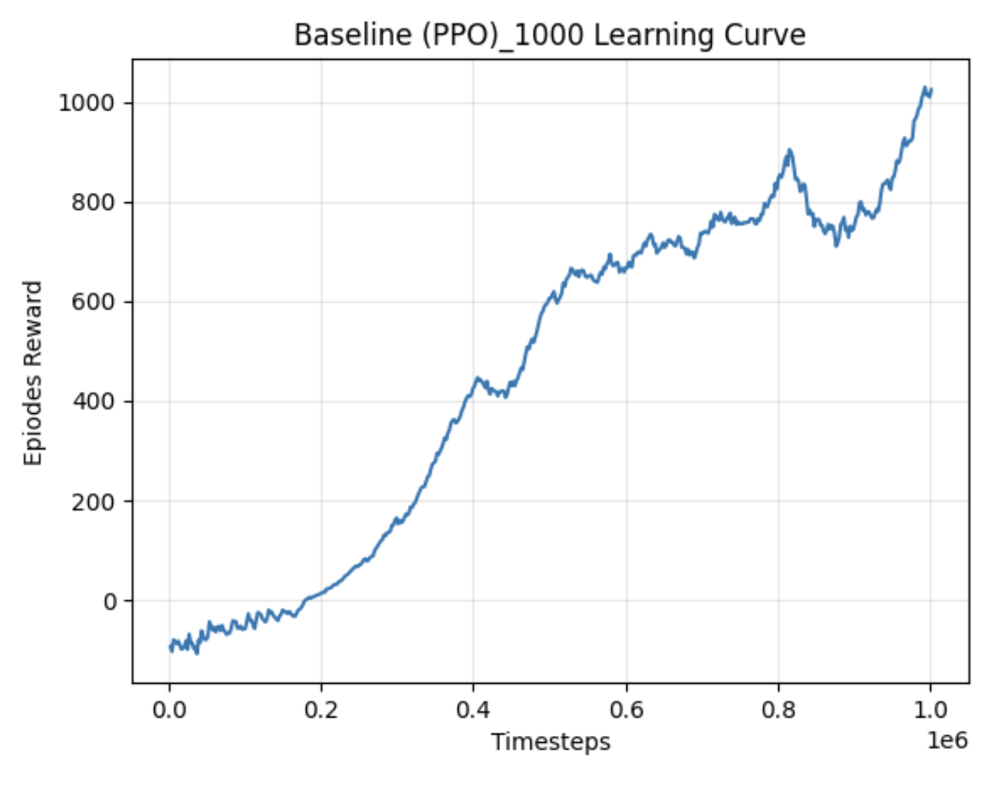
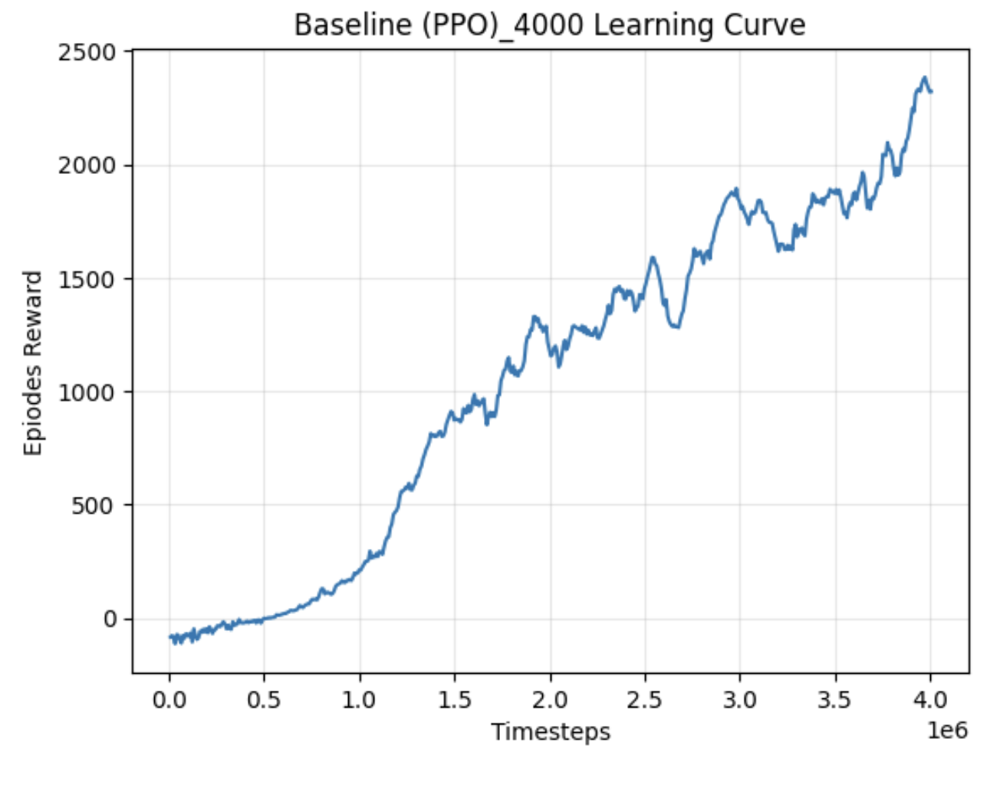
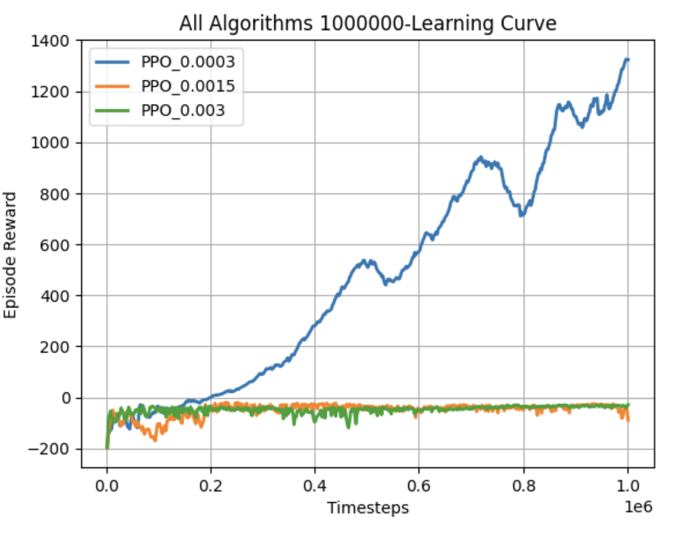
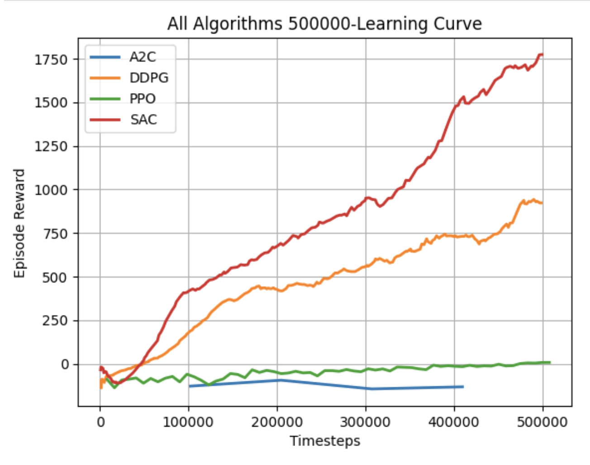
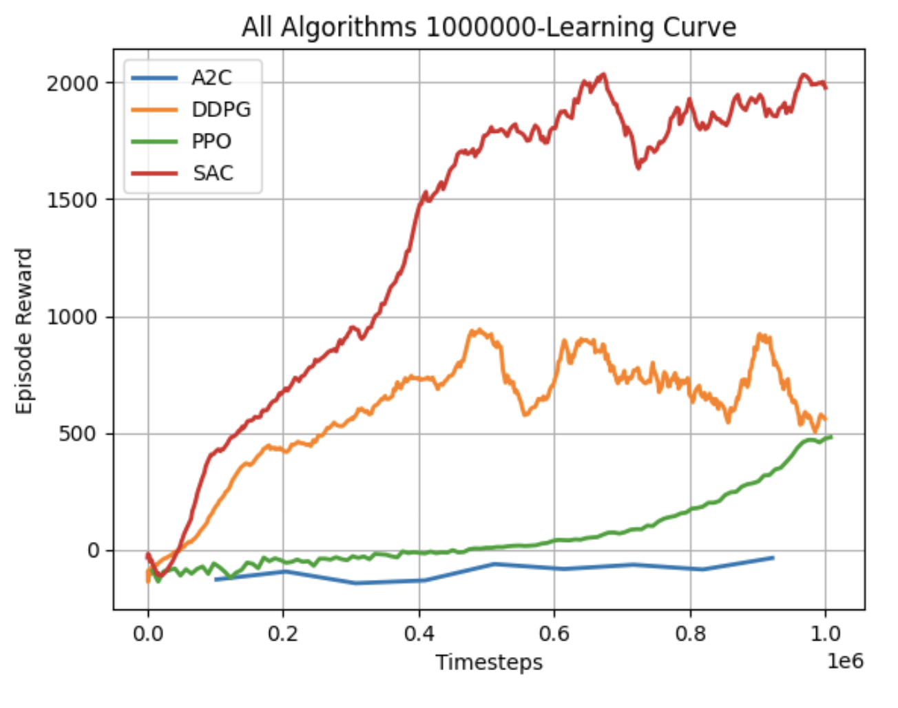

<p align="center">
  
</p>

<h1 align="center">Training Quadruped Locomotion (Ant-v5 moving)</h1>

<p align="center">
  
  
  
</p>

---

- Name: John Song
- Course: EE5329
- Term: Spring 2026
- (Report)[https://github.com/Johncxsong/EE5329-RL/blob/main/report_final.ipynb]

## Quick Start 

### 1.0 Windows setup
1. run `git clone https://github.com/Johncxsong/EE5329-RL.git`
 or download as zip file
2. run `cd EE5329-RL`

3. run 
```bash
conda create -n John_RL python=3.11 -y
conda activate John_RL
python -m pip install --upgrade pip
pip install -r requirements.txt --no-cache-dir
```


---

### 1.1 Ubuntu/ Linux setup 

1. run `git clone https://github.com/Johncxsong/EE5329-RL.git`
 or download as zip file
2. run `cd EE5329-RL`
3. run `chmod +x setup_rl.sh` and `./setup_rl.sh`
4. run `conda activate John_RL`

---

### 2. Run code
1. run train part `python train.py --exp 1`
2. run evaluation part `python evaluation.py --exp 1`


### 3. Experiment explantion
- `train.py` contains: `experiment A`, `experiment B`, and `experiment C`
```python
python train.py --exp 1  # experiment A  (baseline)
python train.py --exp 2  # experiment B  (comparing learning rate)
python train.py --exp 3  # experiment C  (benchmark)

#### or run all three together
python train.py --exp 1 2 3
```

- `evaluation.py` contains: `experiment A`, `experiment B`, and `experiment C`  for each numerical result and recording videos. 

```python
python evaluation.py --exp 1  # experiment A  (baseline)
python evaluation.py --exp 2  # experiment B  (comparing learning rate)
python evaluation.py --exp 3  # experiment C  (benchmark)

#### or run all three together
python evaluation.py --exp 1 2 3
```


### 4. Check training process (learning curve, training loss...)

1. run `tensorboard --logdir ./logs/experiment_A/`
2. open `http://localhost:6006/` in a broswer
3. there are 3 section in main page (**rollout** | **train** | **time**)


## Performance  
- *seed* = 42 

### Experiment A

<table>
  <tr>
    <td></td>
    <td></td>
  </tr>
</table>


**Final Performance Over 50 Episodes (Environment: Ant-v5)**
- timesteps 1000_000 vs. 4000_000

| Algorithm | Mean ± 95% CI | Median | IQR | Min / Max |
| :--- | :--- | :--- | :--- | :--- |
| **PPO-1000** | 1608.47 ± 156.73 | 1906.55 | 796.07 | 11.9 / 2086.6 |
| **PPO-4000** | 2992.35 ± 82.28 | 3074.34 | 125.91 | 1524.9 / 3220.0 |


### Experiment B 

<table>
  <tr>
    <td></td>

  </tr>
</table>

**Final Performance Over 50 Episodes (Environment: Ant-v5)** 

- *Training timesteps: 1000_000*

| Algorithm (Learning Rate) | Mean ± 95% CI | Median | IQR | Min / Max |
| :--- | :--- | :--- | :--- | :--- |
| **PPO (3e-4)** | 2140.25 ± 266.74 | 2667.72 | 1154.09 | 25.9 / 2969.3 |
| **PPO (1.5e-3)** | -77.83 ± 89.64 | -25.75 | 11.25 | -2313.8 / -12.0 |
| **PPO (3e-3)** | -26.43 ± 2.06 | -24.57 | 8.13 | -55.5 / -17.4 |


### Experiment C 


<table>
  <tr>
    <td></td>
    <td></td>
  </tr>
</table>

#### Part I 
**Final Performance Over 50 Episodes (Environment: Ant-v5)**

- *Training timesteps: 500_000*

| Algorithm | Mean ± 95% CI | Median | IQR | Min / Max |
| :--- | :--- | :--- | :--- | :--- |
| **A2C_500** | 561.77 ± 99.88 | 563.16 | 697.88 | -6.3 / 1013.5 |
| **DDPG_500** | 549.22 ± 141.09 | 393.28 | 654.75 | 9.8 / 2090.5 |
| **PPO_500** | 211.94 ± 73.69 | 91.56 | 168.88 | 10.9 / 867.6 |
| **SAC_500** | 2395.42 ± 136.72 | 2563.84 | 133.53 | 17.8 / 2725.4 |

#### Part II

- *Training timesteps: 1000_000*

| Algorithm | Mean ± 95% CI | Median | IQR | Min / Max |
| :--- | :--- | :--- | :--- | :--- |
| **A2C_1000** | 4.21 ± 4.16 | 3.86 | 15.66 | -40.3 / 47.3 |
| **DDPG_1000** | 872.16 ± 220.18 | 642.76 | 1278.98 | -406.9 / 3076.9 |
| **PPO_1000** | 1523.37 ± 85.54 | 1616.55 | 79.76 | 191.8 / 1721.5 |
| **SAC_1000** | 2157.36 ± 261.06 | 2589.75 | 1582.14 | 310.6 / 3275.1 |


## Problems 

- use `--no-cache-dir` flag to install `pip install numpy --no-cache-dir`
- if there is issue related installing stable-baselines3, please install `torch` individually then install `stable-baselines3`
